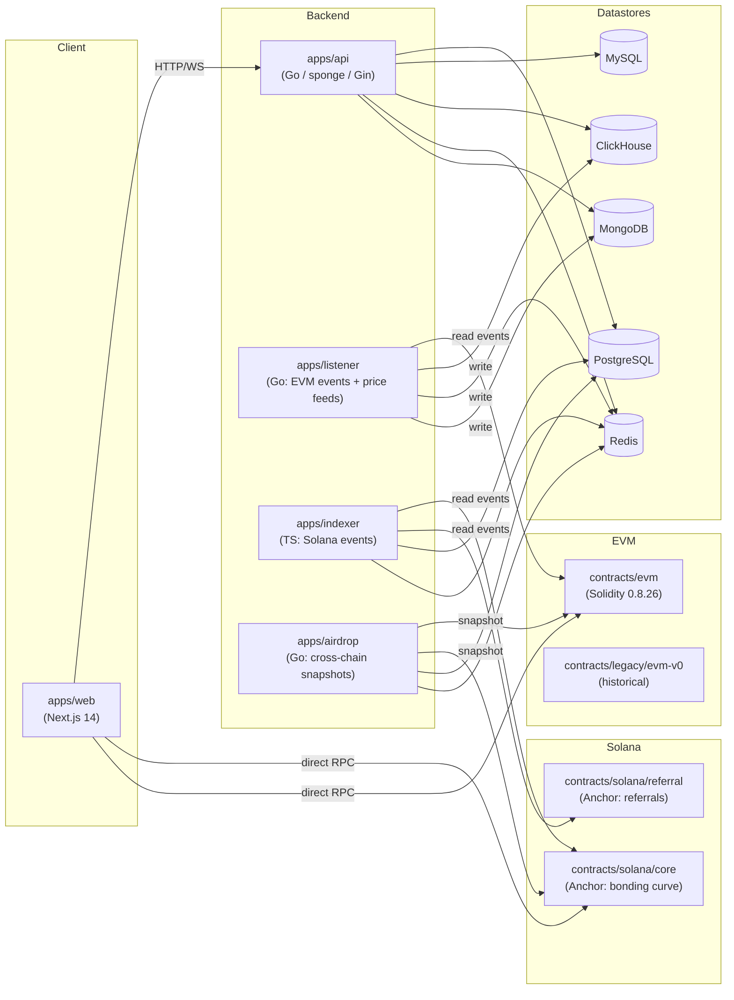

# FairMeme — Architecture

This document explains how the FairMeme platform is composed: what each service does, how they
talk to each other, and which on-chain components they target.

## High-level diagram

## Service contracts

### `apps/web` — frontend

* Next.js 14 App Router, Tailwind, Ant Design + Primereact.
* Solana: `@solana/wallet-adapter-*` + Anchor IDL (`src/abi/fairmemeSolana.json`,
  `fairMemeSolanaProgram.ts`).
* EVM: Wagmi + RainbowKit + Viem.
* Auth: `next-auth` with Twitter OAuth.
* Talks to `apps/api` over REST (`/api/v1/...`) and WebSocket
  (`wss://.../api/v1/ws`).

### `apps/api` — main backend

* Built on the [sponge](https://github.com/zhufuyi/sponge) framework.
* Exposes REST endpoints under `/api/v1` for tokens, trades, members, holders,
  liquidity pools, comments, watch lists, etc.
* Reads on-chain state via go-ethereum + solana-go bindings under
  `internal/contract/abi/`.
* Persists business data in PostgreSQL/MySQL, OLAP into ClickHouse, hot caches
  in Redis. Optional MongoDB for raw chain dumps.
* Configured via `configs/fairmeme.yml` (or Nacos via `fairmeme_cc.yml`).

### `apps/listener` — chain listener + price service

* Multiple `cmd/*` entry points:
  * `cmd/listen_event` — subscribe to EVM contract logs (FairMeme/FairMemeFactory),
    decode and persist trades.
  * `cmd/solprice` — fetch SOL/USD reference price into Redis on a schedule.
  * `cmd/price` — aggregate per-token price snapshots into ClickHouse.
  * `cmd/kline` — produce K-line candles for chart endpoints.
  * `cmd/server`, `cmd/clickServer` — legacy HTTP API endpoints (overlap with
    `apps/api`; flagged in `AUDIT.md` for deprecation).
* Configuration: `config.yaml` (use `config.example.yaml` as a template).

### `apps/indexer` — Solana event indexer

* TypeScript + TypeORM (Postgres).
* Subscribes to Anchor program logs for `fairmeme_sol` and `fairmeme_referral`,
  decodes events through the bundled IDLs in `src/idl/`.
* Stores derived entities (Token, Trade, Holders, TradeLog, InvitationLog,
  members) into Postgres and pushes notifications via Redis pub/sub
  (`apps/api` is the typical subscriber).

### `apps/airdrop` — cross-chain snapshot service

* Go service that, at the configured snapshot timestamp, walks the supported
  chains (eth / base / bsc / solana) and computes every wallet's eligibility
  for the FairMeme airdrop:
  * Address-based eligibility (≥ \$500 across listed chains)
  * Twitter score
  * Token-creation rewards
  * Trade-volume rewards
  * Referral rewards
* Persists results to Postgres; the API surface lives in `apps/api`.

## Smart contracts

### `contracts/evm` (current generation)

* Solidity 0.8.26, viaIR, OpenZeppelin + Solmate + Foundry.
* Core types:
  * `FairMeme` — bonding-curve launcher, mints `MEME20` tokens.
  * `FairMemePairFactory` + `FairMemeSwapPair` — Uniswap-V2-style AMM.
  * `FairMemeSwapRouter` — single-hop & multi-hop swap logic.
  * Libraries: `FairMemeSwapLibrary`, `Math`, `SafeMath`, `UQ112x112`,
    `TransferHelper`.
* Deployment scripts under `script/`. Pre-existing addresses captured in
  `script/DeployFairMeme.s.sol` (verify before reuse).

### `contracts/solana/core` (Anchor)

* Crate `fairmeme-sol`, program ID
  `AyVwefFVyuwgtBQ2cTteN3ZKo4Z4rCgvBtr3tgvnaPpb` (devnet).
* Implements bonding-curve `initialize`/`set_global`/`create`/`buy`/`sell` and
  view ix `get_buy_price`/`get_sell_price`.
* PDA seed: `b"fair-meme-state"` (rebranded from `b"crazy-state"`).

### `contracts/solana/referral` (Anchor)

* Crate `fairmeme-referral`, program ID
  `B5LrGrvdsdsmjYQPrg24kneF8DpztYm2RScq1DsbE92B` (localnet).

### `contracts/legacy/evm-v0`

* Earlier EVM contracts (`FairMemeFactory`, `FairMemeMarket`, `MemeToken`)
  using Sablier-based vesting. Kept for historical reference and explorers
  that may still link to them.

## Cross-cutting concerns

* **Auth / wallet** — frontend uses next-auth (Twitter) + wallet adapter
  signatures. Each backend endpoint that requires identity validates a JWT
  and the session-level wallet ownership.
* **Observability** — sponge framework wires up zap logger, OpenTelemetry,
  Jaeger and Prometheus exposure. Defaults to off; enable in
  `apps/api/configs/fairmeme.yml`.
* **Caching** — Redis used for hot reads (price ticker, user trade rate
  limits) and for inter-service pub/sub (indexer → api).
* **Schema migrations** — Go services use raw SQL under
  `apps/api/migrations/`; TypeScript services rely on TypeORM CLI.

## Recommended deployment topology

* `apps/web` — static export + ISR on Vercel **or** containerized Next.js
  on Kubernetes behind a CDN.
* `apps/api`, `apps/listener`, `apps/airdrop`, `apps/indexer` — independent
  Kubernetes deployments behind a private ingress.
* Postgres + ClickHouse + Redis + MongoDB — managed services.
* Solana RPC: Helius / Triton; EVM RPC: Alchemy / QuickNode (with fallback to
  public llama / publicnode endpoints).
